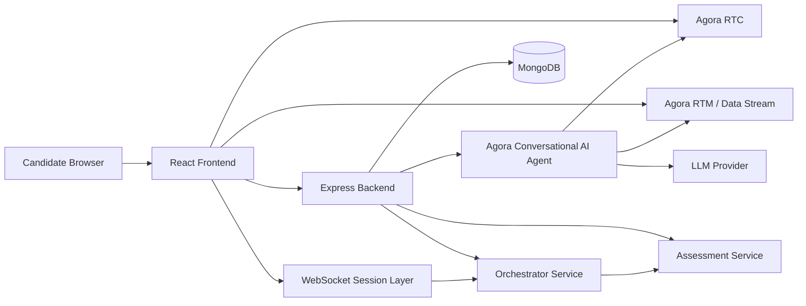

# IntervYou AI

[](https://www.agora.io/en/products/conversational-ai/)[](https://react.dev/)[](https://nodejs.org/)[](https://www.mongodb.com/)[](https://developer.mozilla.org/en-US/docs/Web/API/WebSocket)[](#hackathon-demonstration-plan)

**Resume-Grounded Multi-Agent Voice Interview Platform**

IntervYou AI is a real-time interview practice and assessment platform. A candidate uploads a resume, selects a target role and seniority level, and enters a voice interview with an adaptive AI panel. The panel asks resume-grounded questions, follows up on the candidate’s answers, changes perspective across interview personas, supports a collaborative system-design whiteboard, and produces an evidence-linked assessment report.

Agora provides the real-time audio, speech, signaling, and Conversational AI infrastructure. The IntervYou backend manages resume extraction, interview sessions, persona orchestration, transcript persistence, assessment generation, report history, and deletion controls.

> **Core product promise:** IntervYou AI turns a candidate’s resume into a structured voice interview and explains which resume claims were verified, unverified, contradictory, or unsupported.

## Table of Contents

- [Product Overview](#product-overview)

- [Agora Conversational AI Integration](#agora-conversational-ai-integration)

- [Core Capabilities](#core-capabilities)

- [Architecture](#architecture)

- [Technology Stack](#technology-stack)

- [Project Structure](#project-structure)

- [Requirements](#requirements)

- [Local Setup](#local-setup)

- [Environment Variables](#environment-variables)

- [Running the Application](#running-the-application)

- [Interview Flow](#interview-flow)

- [Panel Personas](#panel-personas)

- [Assessment and Evidence](#assessment-and-evidence)

- [Reports and History](#reports-and-history)

- [API Reference](#api-reference)

- [Real-Time Communication](#real-time-communication)

- [Troubleshooting](#troubleshooting)

- [Security and Privacy](#security-and-privacy)

- [Hackathon Demonstration Plan](#hackathon-demonstration-plan)

- [Known Limitations](#known-limitations)

- [Future Improvements](#future-improvements)

- [Development Commands](#development-commands)

- [Team](#team)

- [References](#references)

## Product Overview

Traditional mock interview tools rely on fixed question banks or generic chat. They rarely connect questions to a candidate’s real experience, and they often provide scores without showing the evidence behind them.

IntervYou AI addresses this problem with a coordinated voice interview panel. The candidate’s resume is extracted from PDF, DOCX, or TXT input. The system identifies technology terms and project-oriented statements. Those signals guide the opening question, adaptive follow-ups, persona handoffs, and the final report.

The candidate can speak naturally, use the camera, view live captions, inspect the active panel persona, and open a synchronized system-design whiteboard. After the session, the candidate receives scores, recommendations, transcript-linked evidence, resume citations, flags, interview duration, and export options.

## Agora Conversational AI Integration

Agora Conversational AI is the central technology in IntervYou AI and the foundation of the hackathon experience. It allows the application to move beyond a text-only interview by combining real-time voice transport, speech recognition, language-model reasoning, speech synthesis, interruption handling, and live signaling in one interview session. Agora’s real-time network is used for low-latency audio communication between the candidate and the AI agent [1].

### How Agora powers the interview

| Agora capability | How IntervYou AI uses it | User-visible result |
| --- | --- | --- |
| Agora RTC | Joins the candidate and Conversational AI agent to the same voice channel. | The candidate can speak and hear the panel in real time. |
| Conversational AI Agent | Runs the voice interaction and connects speech recognition, the LLM, and speech synthesis. | The panel listens, reasons, and speaks naturally. |
| Automatic speech recognition | Converts candidate speech into transcript events. | Candidate answers become usable interview evidence. |
| LLM integration | Generates concise interview responses and adaptive follow-ups. | Questions can respond to the candidate’s actual answer. |
| Text-to-speech | Converts the panel response into spoken audio. | The interview feels like a live conversation rather than a form. |
| Semantic end-of-speech detection | Waits for a natural pause before the agent responds. | The candidate has time to think and finish an answer. |
| RTM signaling | Delivers live transcript and agent-related events. | The interview room can render live conversation state. |
| Reliable ordered data stream | Synchronizes whiteboard operations between participants. | System-design sketches can be shared during the interview. |
| Agora tokens | Backend generates RTC and RTM access credentials. | Credentials remain protected on the server. |

### Agora conversation pipeline

```
Candidate microphone
        ↓
Agora RTC / real-time transport
        ↓
Agora Conversational AI Agent
        ├── Speech recognition
        ├── Resume-aware LLM instructions
        ├── Persona and follow-up policy
        ├── Semantic turn detection
        └── Text-to-speech
        ↓
Spoken AI response to the candidate
```

### Conversation design

The agent is configured to ask one focused question at a time. It is instructed to prefer concrete resume projects and technologies over generic question banks. It avoids repeating earlier questions, asks for clarification when an answer conflicts with the resume or previous statements, and hands the conversation to another panel persona only when a new perspective is useful.

The backend starts the agent through Agora’s Conversational AI API. It enables RTM delivery for live transcript events and configures semantic end-of-speech detection. The frontend joins the generated RTC channel, publishes the candidate microphone, subscribes to the agent audio, and renders transcript and connection state.

### Why Agora is important to the solution

The product depends on real-time voice interaction rather than asynchronous text prompts. Agora supplies the communication layer that makes the experience immediate, interruptible, and collaborative. This lets the IntervYou backend focus on resume context, panel coordination, evidence collection, and fair assessment while Agora handles the live conversational media pipeline.

### Agora configuration responsibilities

The following values must remain on the backend:

```
AGORA_APP_ID=your_agora_app_id
AGORA_APP_CERTIFICATE=your_agora_app_certificate
AGORA_CUSTOMER_ID=your_agora_customer_id
AGORA_CUSTOMER_SECRET=your_agora_customer_secret
```

The frontend receives session-specific RTC and RTM credentials from the authenticated interview-start response. Customer credentials and REST API secrets are never required in frontend environment variables.

## Core Capabilities

| Capability | Description |
| --- | --- |
| Resume upload | Accepts PDF, DOCX, and TXT resumes. |
| Resume extraction | Extracts readable text and identifies technologies and project signals. |
| Voice interview | Uses Agora RTC and Conversational AI services for live audio interaction. |
| Multi-persona panel | Supports Technical Lead, Hiring Manager, Product Lead, Behavioural Lead, and Customer Advocate perspectives. |
| Adaptive questioning | Follows up on projects, technologies, decisions, ownership, results, and challenges. |
| Focused turn-taking | Uses semantic end-of-speech detection so the agent waits for a natural pause. |
| Live transcript | Shows AI questions and candidate answers during the interview. |
| Collaborative whiteboard | Provides a synchronized system-design canvas through Agora data streams. |
| Evidence-based assessment | Uses transcript evidence, resume signals, answer quality, and interview flags. |
| Insufficient-evidence protection | Short sessions receive `N/A` rather than misleading scores. |
| Resume citations | Shows resume technologies and project claims beside supporting interview answers. |
| Session history | Lists completed reports by role, date, time, and resume filename. |
| Session deletion | Allows a signed-in user to delete an individual past session. |
| Export | Supports JSON export and browser-based PDF printing. |
| Reconnection | Provides Agora and WebSocket status with a reconnect action. |

## Architecture



### Runtime responsibilities

| Layer | Responsibility |
| --- | --- |
| React frontend | Interview setup, authentication views, interview room, transcript, whiteboard, report, and history UI. |
| Agora RTC | Real-time candidate and AI audio transport. |
| Agora RTM and data stream | Transcript signaling and whiteboard synchronization. |
| Express backend | Authentication, resume upload, session lifecycle, Agora credentials, reports, and history APIs. |
| WebSocket session layer | Live candidate utterance forwarding, persona responses, and assessment events. |
| Orchestrator service | Session context, persona routing, transcript state, difficulty, and report lifecycle. |
| Assessment service | Answer analysis, score gating, flags, resume alignment, and evidence generation. |
| MongoDB | Users, interviews, transcripts, reports, timing metadata, and history. |
| LLM provider | Optional model-backed assessment and orchestration support. |

## Technology Stack

### Frontend

- React 18

- Vite

- React Router

- Tailwind CSS

- Lucide React

- `agora-rtc-sdk-ng`

- Agora RTM SDKs

- Agora Agent Client Toolkit

### Backend

- Node.js with ECMAScript modules

- Express

- MongoDB with Mongoose

- WebSocket with `ws`

- Multer for uploads

- `pdf-parse` for PDF extraction

- Mammoth for DOCX extraction

- JWT and bcrypt-based authentication

- Axios for Agora and provider API calls

### External services

- Agora Conversational AI and RTC

- MongoDB or MongoDB Atlas

- Optional OpenAI-compatible or Bedrock-compatible LLM provider

- Optional AWS S3 and Bedrock configuration

## Project Structure

```
Intervyou/
├── backend/
│   ├── src/
│   │   ├── config/
│   │   ├── controllers/
│   │   ├── middleware/
│   │   ├── models/
│   │   ├── routes/
│   │   ├── services/
│   │   │   └── orchestrator/
│   │   ├── sockets/
│   │   ├── utils/
│   │   └── server.js
│   ├── .env.example
│   └── package.json
├── frontend/
│   ├── src/
│   │   ├── components/
│   │   ├── context/
│   │   ├── hooks/
│   │   ├── pages/
│   │   ├── App.jsx
│   │   └── index.css
│   ├── .env.example
│   └── package.json
├── docker-compose.yml
└── README.md
```

## Requirements

| Requirement | Recommended version | Purpose |
| --- | --- | --- |
| Node.js | 18 or newer | Runs the frontend and backend. |
| npm | Included with Node.js | Installs dependencies and runs scripts. |
| MongoDB | 6 or newer | Stores users, interviews, reports, and history. |
| Agora account | Active project | Provides RTC, RTM, and Conversational AI credentials. |
| Modern browser | Chrome or Edge recommended | Provides microphone, camera, WebRTC, and download support. |

Microphone and camera access must be granted by the browser for the complete voice and video experience. Camera access is optional for audio-only use, but microphone access is required for spoken answers.

## Local Setup

### 1. Clone or extract the project

```bash
git clone <your-repository-url>
cd Intervyou
```

If the project was delivered as an archive, extract it and open a terminal in the extracted `Intervyou` directory.

### 2. Install backend dependencies

```bash
cd backend
npm install
```

### 3. Install frontend dependencies

```bash
cd ../frontend
npm install
```

### 4. Start MongoDB

Use a local MongoDB service or MongoDB Atlas. The default local database URL is:

```
mongodb://localhost:27017/intervyou
```

### 5. Create environment files

Create `backend/.env` from `backend/.env.example` and create `frontend/.env` from `frontend/.env.example`.

Never commit `.env` files or production credentials to source control.

## Environment Variables

### Backend environment

Create `backend/.env`:

```
# Server
PORT=5000
NODE_ENV=development
CLIENT_ORIGIN=http://localhost:5173

# Database
MONGO_URI=mongodb://localhost:27017/intervyou

# Authentication
JWT_SECRET=replace_with_a_long_random_secret

# Agora
AGORA_APP_ID=your_agora_app_id
AGORA_APP_CERTIFICATE=your_agora_app_certificate
AGORA_CUSTOMER_ID=your_agora_customer_id
AGORA_CUSTOMER_SECRET=your_agora_customer_secret
AGORA_AGENT_NAME=intervyou_panel

# LLM provider
LLM_PROVIDER=mock
LLM_API_KEY=your_llm_api_key
LLM_MODEL=your_model_id

# Optional AWS configuration
AWS_REGION=us-east-1
AWS_ACCESS_KEY_ID=
AWS_SECRET_ACCESS_KEY=
AWS_S3_BUCKET=intervyou-resumes
```

| Variable | Required | Description |
| --- | --- | --- |
| `PORT` | Yes | Backend HTTP and WebSocket port. Defaults to `5000`. |
| `CLIENT_ORIGIN` | Yes | Allowed frontend origin. |
| `MONGO_URI` | Yes | MongoDB connection string. |
| `JWT_SECRET` | Yes | Secret used to sign authentication tokens. |
| `AGORA_APP_ID` | Yes | Agora project App ID. |
| `AGORA_APP_CERTIFICATE` | Yes | Agora certificate used for token generation. |
| `AGORA_CUSTOMER_ID` | Yes | Agora REST API customer ID. |
| `AGORA_CUSTOMER_SECRET` | Yes | Agora REST API customer secret. |
| `AGORA_AGENT_NAME` | Optional | Default Conversational AI agent name. |
| `LLM_PROVIDER` | Optional | LLM mode such as `mock` or an OpenAI-compatible provider. |
| `LLM_API_KEY` | Provider-dependent | API key for the selected LLM provider. |
| `LLM_MODEL` | Provider-dependent | Model identifier for the selected provider. |

### Frontend environment

Create `frontend/.env`:

```
VITE_API_BASE_URL=http://localhost:5000
VITE_WS_URL=ws://localhost:5000/ws/session
VITE_AGORA_APP_ID=your_agora_app_id
```

`VITE_API_BASE_URL` is used for HTTP requests. `VITE_WS_URL` is used for the live session WebSocket. Agora customer credentials must remain on the backend.

## Running the Application

Open two terminals.

### Terminal 1: backend

```bash
cd backend
npm run dev
```

The backend listens on:

```
http://localhost:5000
```

The live session WebSocket listens on:

```
ws://localhost:5000/ws/session
```

### Terminal 2: frontend

```bash
cd frontend
npm run dev
```

Open the URL printed by Vite. The default development URL is:

```
http://localhost:5173
```

### Production build

```bash
cd frontend
npm run build
npm run preview
```

The backend production command is:

```bash
cd backend
npm start
```

### Docker

If Docker configuration is available for the deployment environment:

```bash
docker-compose up --build
```

## Interview Flow

1. The candidate creates an account or signs in.

1. The candidate uploads a PDF, DOCX, or TXT resume.

1. The candidate selects a target role and seniority level.

1. The backend extracts the resume text and creates an active interview record.

1. The backend generates candidate RTC and RTM credentials.

1. The backend starts an Agora Conversational AI agent.

1. The orchestrator creates an in-memory session context containing the resume, profile, transcript, difficulty, and flags.

1. The agent opens with a concise question grounded in the resume.

1. The candidate answers through the microphone.

1. Agora endpointing waits for a natural pause before the AI responds.

1. Candidate transcript events are forwarded to the orchestrator.

1. The panel selects a focused follow-up or a relevant persona handoff.

1. The candidate may use the synchronized whiteboard during system-design discussion.

1. The candidate ends the interview.

1. The backend stops the agent, generates the final report, saves timing metadata, and persists the transcript.

1. The frontend opens the report with scores, evidence, flags, transcript, and export controls.

## Panel Personas

| Persona | Primary evaluation area | Example focus |
| --- | --- | --- |
| Technical Lead | Technical depth and architecture | APIs, databases, algorithms, testing, trade-offs, deployment, and system design. |
| Hiring Manager | Ownership and leadership | Responsibilities, collaboration, decision-making, and growth. |
| Product Lead | Product reasoning | User needs, prioritization, requirements, and measurable outcomes. |
| Behavioural Lead | Behavioural evidence | Conflict, feedback, failure, learning, communication, and teamwork. |
| Customer Advocate | Customer impact | User empathy, reliability, support, impact, and communication with users. |

A handoff should happen when the topic changes or another perspective adds evaluation value. The panel should not force every persona into every interview.

## Assessment and Evidence

The assessment service evaluates the completed transcript using:

- Candidate answer count

- Candidate word count

- Technical terms and explanations

- Behavioural evidence

- Resume technology alignment

- Contradiction flags

- Vague-answer flags

- Target role and seniority

- Final interview difficulty

### Evidence threshold

A complete score requires at least:

```
2 substantive candidate answers
50 total candidate words
```

Short interviews show `Insufficient evidence` and display `N/A` rather than presenting unsupported marks.

### Evidence states

| State | Meaning |
| --- | --- |
| Mentioned in interview | A resume technology was found in a candidate answer. |
| Resume project evidence | A project claim shares meaningful terms with a candidate answer. |
| Not directly verified | A resume technology was found but was not clearly discussed. |
| Contradictory | A candidate answer conflicts with resume context or previous answers. |
| Insufficient evidence | The interview did not contain enough candidate material for reliable scoring. |

Technology matching normalizes punctuation and spacing. For example, `Node.js`, `Node Js`, and `nodejs` can be treated as the same technology signal.

## Reports and History

The final report includes:

- Technical Depth

- Communication Clarity

- Behavioural Evidence

- Resume Alignment

- Role Alignment

- Overall recommendation

- Resume evidence citations

- Verified strengths

- Development areas

- Candidate response count

- Final difficulty

- Assessment flags

- Interview duration

- Start time

- End time

- Completion reason

- Verified dialogue log

The report supports two export actions:

- **JSON** downloads the report, transcript, role, level, and export timestamp.

- **Save PDF** opens the browser print workflow with print-specific report styling.

Completed sessions appear in Past Sessions. Each entry identifies the role, date, time, and uploaded resume filename. The trash button deletes the selected session after confirmation.

## API Reference

All routes below are mounted under `/api/interview` unless otherwise stated. Protected routes require the authentication token managed by the frontend authentication context.

| Method | Path | Purpose |
| --- | --- | --- |
| `POST` | `/api/auth/signup` | Create a user account. |
| `POST` | `/api/auth/login` | Authenticate a user. |
| `GET` | `/api/interview/history` | Return completed sessions for the signed-in user. |
| `POST` | `/api/interview/start` | Upload a resume and start an interview. Uses multipart field `resume`. |
| `GET` | `/api/interview/:sessionId/report` | Load a persisted report. |
| `DELETE` | `/api/interview/:sessionId` | Delete one session belonging to the signed-in user. |
| `POST` | `/api/interview/end` | Stop the agent and finalize the report. |
| `POST` | `/api/interview/speak` | Send an agent speech request when used by the orchestration flow. |

### Start interview request

The start endpoint accepts multipart form data:

```
resume: PDF, DOCX, or TXT file
role: target role
level: seniority level
```

A successful response contains the session ID, RTC credentials, agent metadata, channel name, and panel configuration.

### End interview request

```json
{
  "sessionId": "session_123456",
  "agentId": "agora-agent-id",
  "completionReason": "normal"
}
```

Supported completion reasons are `normal`, `interrupted`, and `unknown`.

## Real-Time Communication

The frontend opens a WebSocket connection at `/ws/session`. It sends a join message after connection:

```json
{
  "type": "join",
  "sessionId": "session_123456"
}
```

Final candidate transcript messages use:

```json
{
  "type": "candidate_final_transcript",
  "sessionId": "session_123456",
  "text": "The candidate's finalized answer"
}
```

The server can broadcast events such as:

- `joined`

- `candidate_utterance`

- `persona_response`

- `assessment_flag`

- `error`

Agora RTC handles live voice. Agora RTM and the reliable ordered data stream support transcript signaling and whiteboard operations. The UI displays connection state and provides a reconnect action when the connection is interrupted.

## Troubleshooting

### `AGORA_APP_ID is missing from backend environment`

Confirm that `backend/.env` exists and contains a real value for `AGORA_APP_ID`. Restart the backend after changing environment variables.

```bash
cd backend
npm run dev
```

### The AI speaks generic questions

Start a new interview after updating prompt or agent configuration. Agora agent settings are applied when the agent starts. Confirm that the uploaded resume contains readable text and concrete projects or technologies.

### The AI interrupts too quickly

The active Agora configuration uses semantic end-of-speech detection with a natural silence period. Restart the backend and create a new interview after changing this configuration. Existing agents keep the settings from the time they were created.

### The report shows `N/A`

Check the report’s candidate response count and transcript. A complete report requires at least two candidate answers and fifty candidate words. If the transcript shows candidate turns but the count is zero, verify that the latest `Report.jsx` and `assessment.service.js` files are installed.

### Candidate replies appear as AI Panel

Use the latest `InterviewRoom.jsx` and `Report.jsx`. Candidate detection supports candidate roles, candidate event types, common local-user labels, and numeric Agora UIDs. The AI agent UIDs `9999` and `99999` are excluded from candidate classification.

### Past Session opens to a black screen

Open the browser developer console and look for a React rendering error. Ensure the latest `Report.jsx` is installed. The report evidence fallback must render `item.technology`, not the entire evidence object.

### Report does not load from Past Sessions

Confirm that the backend is running, the user is authenticated, and the session still exists. The report request is:

```
GET /api/interview/:sessionId/report
```

### Camera does not appear

Grant camera permission to the frontend origin. The interview can continue without camera access, but the local video panel will display a camera-off state.

### Microphone does not work

Grant microphone permission, verify the correct input device in the browser, and reload the page. Agora voice requires a secure browser context in production. `localhost` is permitted for local development.

### Whiteboard does not synchronize

Confirm that both participants are in the same Agora channel and that the reliable ordered data stream was created. Voice remains independent of the whiteboard data stream.

## Security and Privacy

The application should be operated with the following practices:

- Keep `.env` files outside source control.

- Use a long random `JWT_SECRET` in production.

- Use HTTPS and WSS in production.

- Restrict `CLIENT_ORIGIN` to the deployed frontend origin.

- Keep Agora customer credentials on the backend only.

- Do not expose `AGORA_CUSTOMER_SECRET` to the frontend.

- Enforce authentication on history, report, start, end, speak, and delete routes.

- Scope report and delete queries to the authenticated user.

- Limit resume uploads to supported extensions and the configured file size.

- Remove temporary uploaded resume files after extraction.

- Provide a clear retention policy for resumes, transcripts, audio, video, and reports.

The product allows users to delete completed interview sessions from Past Sessions. Production deployments should document how long data is retained and whether audio or video is stored.

## Hackathon Demonstration Plan

A strong demonstration should show the complete product loop rather than isolated screens.

### Recommended demo sequence

1. Sign in and upload a prepared resume containing a concrete project, technologies, and measurable result.

1. Select a target role and seniority level.

1. Start the interview and show the resume-specific opening question.

1. Give an answer that mentions a technical decision.

1. Show the focused follow-up question.

1. Give an answer that conflicts with the resume.

1. Show the AI requesting clarification instead of silently accepting the claim.

1. Demonstrate a persona handoff from technical evaluation to ownership or behavioural evaluation.

1. Open the system-design whiteboard and draw a simple architecture.

1. End the interview and show the evidence-backed report.

1. Open Resume evidence citations and show the answer linked to a resume technology or project claim.

1. Export the report as PDF or JSON.

1. Return to Past Sessions and show the unique session label and delete control.

### Suggested prepared resume content

Use a demo resume containing a project such as:

```
Built an AI quiz platform using React, Node.js, MongoDB, and Redis.
Implemented the backend API, designed the quiz data model, and improved response time by 40% using caching.
```

This gives the AI concrete material for questions about ownership, technology selection, database design, caching, and measurable impact.

### Suggested judge-facing explanation

> IntervYou AI turns a resume into a live, structured voice interview. Agora handles the real-time voice experience, while our backend orchestrates multiple interview perspectives and produces a report that distinguishes verified, unverified, contradictory, and insufficient evidence.

## Known Limitations

- Voice quality and transcript quality depend on browser permissions, network conditions, and configured Agora services.

- Resume signal extraction is currently rule-based and depends on readable resume text.

- Evidence matching is lexical and should not be treated as a full semantic fact-checker.

- Assessment scores are decision-support signals, not employment decisions.

- The application currently uses an in-memory orchestrator session store. A process restart can lose active orchestration state even when the MongoDB interview record exists.

- Production deployments should add rate limiting, structured audit logging, monitoring, and durable session recovery.

- The frontend bundle includes large Agora dependencies. Code splitting can improve initial load performance.

- PDF export currently uses the browser print workflow rather than a server-side PDF renderer.

## Future Improvements

The next high-value improvements are quality and reliability improvements rather than unrelated features:

- Replace lexical resume matching with structured resume extraction and semantic evidence retrieval.

- Add an interview coverage indicator for technical, ownership, system-design, behavioural, product, and customer-impact areas.

- Persist active orchestrator state for recovery after backend restarts.

- Add automated tests for transcript speaker classification and score thresholds.

- Add end-to-end tests for resume upload, interview completion, report loading, and deletion.

- Add rate limiting and operational monitoring.

- Add consent, retention, and data-export controls for production privacy compliance.

- Add a judge-ready architecture diagram and recorded demo video to the submission materials.

## Development Commands

### Backend

```bash
cd backend
npm install
npm run dev
npm start
```

### Frontend

```bash
cd frontend
npm install
npm run dev
npm run build
npm run preview
```

### Backend syntax validation

```bash
cd backend
for f in $(find src -type f -name '*.js' | sort ); do node --check "$f" || exit 1; done
```

### Frontend production validation

```bash
cd frontend
npm run build
```

## Deployment

### Live URLs
- **Frontend:** https://ai-interview-41hm.vercel.app
- **Backend:** https://ai-interview-5pna.onrender.com


## Team

| Name | Role |
| --- | --- |
| Saumya Tiwari | Frontend Developer |
| Saloni Kumari | Backend Developer |

## License

Add the project license selected by the team before public release. If no license has been selected, keep the repository private until licensing and third-party service terms have been reviewed.

## References

[1]: https://docs.agora.io/en/ai/build/shape-the-conversation/interrupt-agent "Agora Conversational AI Engine: Interrupt the agent mid-response"

[2]: https://docs.agora.io/en/voice-calling/get-started/get-started-sdk "Agora Voice Calling SDK documentation"

[3]: https://developer.mozilla.org/en-US/docs/Web/API/WebSocket "MDN WebSocket API reference"

[4]: https://www.mongodb.com/docs/manual/ "MongoDB Manual"

[5]: https://vite.dev/guide/ "Vite documentation"

[6]: https://react.dev/learn "React documentation"

---

**IntervYou AI** is a voice-first interview practice and assessment project built to make interview preparation more personal, interactive, and evidence-oriented.
